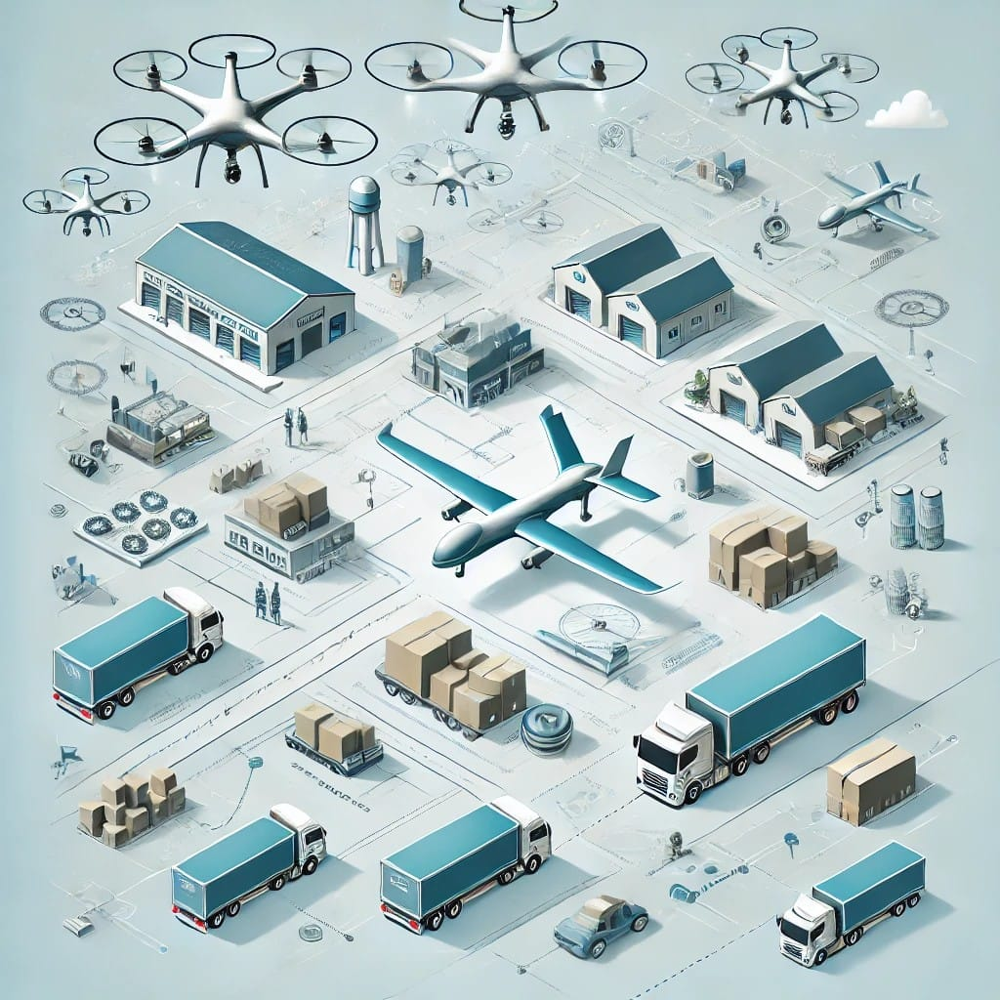

# Drone Delivery System

## Project Overview

This **Drone Delivery System** simulates a network of warehouses that deliver products using drones. Each warehouse has two types of drones:

- **Short-Distance Drones** (less range, cheaper cost)
- **Long-Distance Drones** (greater range, higher cost)
<p align="center">
  
</p>
The system efficiently calculates delivery paths between warehouses, determines whether a product is available, and computes the delivery charges based on distance and drone type using Dijkstra's algorithm for shortest path calculation.


## Features

- **Warehouses and Drones**: Each warehouse is equipped with both short-distance and long-distance drones. Each drone has a specific battery capacity which limits the distance they can travel.
- **Product Management**: Products can be stored in different warehouses. The system checks availability in nearby warehouses and calculates delivery costs.
- **Pathfinding**: The system uses **Dijkstra's Algorithm** to find the shortest delivery route between warehouses based on their distances.
- **Dynamic Delivery System**: New warehouses and products can be added, and delivery orders can be placed dynamically.
- **Error Handling**: The system gracefully handles errors, such as when a product is not available in any warehouse.

## Tech Stack

- **Language**: C++
- **Algorithms**: Dijkstra’s algorithm for shortest path calculations, Breadth First Search(BFS) for nearest warehouse with the product.
- **Design Concepts**: Object-Oriented Programming (OOP) principles such as inheritance, polymorphism, and encapsulation.

## Class Structure

1. **Drone** (Base Class):

   - Represents a generic drone with a given battery capacity.
   - Subclasses:
     - `Shortdistancedrone`
     - `Longdistancedrone`

2. **Warehouse**:

   - Represents a warehouse with neighbors (other warehouses) and stored products.
   - Includes logic for managing drones, checking product availability, and calculating delivery costs.
   - Uses Dijkstra's algorithm to find the shortest distance to another warehouse.

3. **DeliveryOrder**:

   - Represents a delivery request between two warehouses for a specific product.
   - Calculates the delivery distance, checks product availability, and determines the delivery charge.

4. **Dronedeliverysystem**:
   - Manages the entire system: warehouses, products, delivery orders, and drone deliveries.
   - Finds the nearest warehouse with the requested product and processes delivery orders.
   
## Code-[main.cpp](https://github.com/saisudheerp/Drone-Delivery-System/blob/main/main.cpp)


## Code Explanation


### Key Parts of the Code

#### 1. Dijkstra’s Algorithm for Shortest Path

The system calculates the shortest delivery route using **Dijkstra’s Algorithm**. This ensures that the drone delivery cost and distance are optimized based on the graph of connected warehouses.

#### 2. Delivery Charge Calculation

The delivery charge is calculated based on the drone’s ability to deliver the product. Short-distance drones are cheaper but limited by range, while long-distance drones are more expensive but can cover greater distances.

#### 3. Warehouse and Product Management

The system allows adding multiple warehouses and products dynamically, ensuring flexibility in product availability checks and warehouse operations.

## How the System Works

1. **Add Warehouses and Neighbors**: The system adds warehouses and connects them via distances. These represent real-world paths between distribution centers.
2. **Store Products**: Products are stored in specific warehouses. The system can query any warehouse to check if a particular product is available.

3. **Place Delivery Orders**: Users can request to deliver a product from the nearest warehouse that holds it to the destination warehouse.

4. **Calculate the Shortest Delivery Path**: Using Dijkstra’s algorithm, the system calculates the shortest path between warehouses and finds the optimal drone for delivery.

5. **Display Delivery Details**: After placing an order, the system displays the details of the delivery, including the warehouse IDs, distance, product availability, and total delivery charge.

## Sample Output

The program will output the delivery details for each delivery order, including:

- Source warehouse
- Destination warehouse
- Product being delivered
- Whether the product is available
- Delivery distance
- Delivery charge

Example:

```yaml
Delivery Details:
Source Warehouse: 1
Destination Warehouse: 2
Product: Product A
Product Available: Yes
Distance: 5 units
Delivery Charge: $10
```


## Future Improvements

- **Dynamic Warehouse Connectivity**: Add functionality to dynamically remove or update connections between warehouses.
- **More Drone Types**: Expand the system to include more drone types, such as mid-range drones, or even autonomous delivery trucks.
- **Real-World Integration**: Implement geolocation and mapping APIs for real-world delivery simulation.
- **Advanced Pathfinding**: Integrate other advanced algorithms like A\* for more specific pathfinding improvements.
